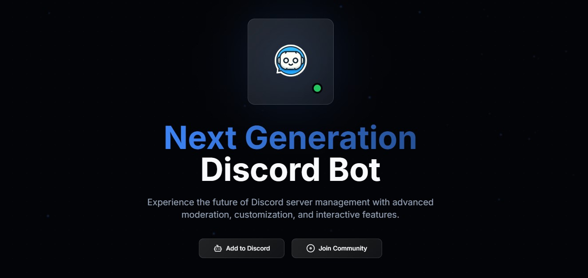

# Discord Bot Website 🚀

The Futuristic Next.js Website For Discord Bot, For You 🎯



## Description

Welcome to the Discord Bot Website! This project is built using Next.js and is designed to provide a sleek and modern web interface for your Discord bot. Whether you are a developer looking to showcase your bot or a user wanting to interact with it, this website offers a user-friendly experience.

## Features ✨

- **Next.js Framework**: Leveraging the power of Next.js for server-side rendering and static site generation.
- **Responsive Design**: Optimized for all devices, ensuring a seamless experience on desktops, tablets, and mobile phones.
- **Interactive UI**: A dynamic and engaging user interface built with modern web technologies.
- **TypeScript**: Written in TypeScript for type safety and better developer experience.
- **Styling with CSS**: Custom CSS for styling the components and layout.

## Tech Stack 🛠️

- **TypeScript**: 97.8%
- **CSS**: 2%
- **JavaScript**: 0.2%

## Getting Started 🚀

To get started with the project, follow these steps:

1. **Clone the repository**:
    ```bash
    git clone https://github.com/RishBroProMax/discord-bot-website.git
    cd discord-bot-website
    ```

2. **Install dependencies**:
    ```bash
    npm install
    ```

3. **Run the development server**:
    ```bash
    npm run dev
    ```

4. **Open your browser**:
    Navigate to `http://localhost:3000` to see the website in action.

## Scripts 📜

- `npm run dev`: Starts the development server.
- `npm run build`: Builds the project for production.
- `npm start`: Runs the built project in production mode.
- `npm run lint`: Runs the linter to check for code consistency.

## Contributing 🤝

We welcome contributions from the community! If you would like to contribute, please follow these steps:

1. Fork the repository.
2. Create a new branch (`git checkout -b feature/YourFeature`).
3. Commit your changes (`git commit -am 'Add new feature'`).
4. Push to the branch (`git push origin feature/YourFeature`).
5. Create a new Pull Request.

## License 📄

This project is licensed under the MIT License. See the [LICENSE](LICENSE) file for more details.

## Contact 📧

If you have any questions or feedback, feel free to reach out to the repository owner:

- **GitHub**: [RishBroProMax](https://github.com/RishBroProMax)

Enjoy building and using your futuristic Discord bot website! 🎉